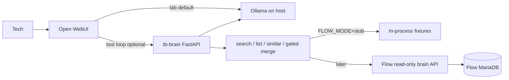

# tb-brain

TechBldrs’ local MSP **superbrain**: a **tool-calling agent over MSP systems**, not a vector dump of Flow.

Flow (`flow.techbldrs.com`, Flask/MariaDB) stays the system of record. Tickets, contacts, and mail are queried through **named tools**. RAG/Qdrant is for SOPs/runbooks/notes only — **phase 3, not now**.

This repo is a lab on a daily-driver Windows box. Architecture must survive a GPU/hostname swap: **stable tool names** + **`LLM_BASE_URL` from env**. Do not hardcode this PC or a model size.

## What works in phase 0

Example questions answered via tools (stub Flow data until a read-only API/DB user is wired):

| Question | Tools |
|---|---|
| When did Debe last reach out? | `search_contact` → `list_mail` (inbound, that contact) |
| What was the last WDON ticket? | `latest_ticket(client_code=WDON)` |
| Show all emails from WDON to our tenant | `list_mail(WDON, inbound)` |
| Give me all tickets assigned to Tre | `search_technician(Tre)` → `list_tickets(assignee_code=ts, limit=100)` |
| What tickets need merged for ZINT? | `find_similar_tickets(client_code=ZINT)` (suggests only) |
| Merge ZTB-1691 into ZTB-1680 | `merge_tickets(confirm=true, labels…)`, only after the plan was shown and the user restated both labels |

WDON = Western Dental. Mail in Flow is **ticket-attached** (`inbound` / `outbound` / `imported`). Microsoft Graph is only for mail that was **never filed on a ticket** — not this phase.

## Hard rules

- **Local only.** No cloud LLM for client data (dental/PHI).
- **Read-only by default.** No send-mail, no close-ticket. The one write is `merge_tickets`: chat-only (no `/tools` route), needs `confirm=true`, the plan shown first, the user's latest message restating both labels, and a verified Open WebUI identity forwarded to Flow as `X-Brain-Actor-Email`. Otherwise it fails closed.
- **Do not auto-inject IT Glue passwords** into prompts.
- **Log every tool call** (actor, client, tool, row ids) off OneDrive.
- **No OneDrive for runtime data.** This folder syncs; venv/models/Qdrant/Docker volumes must not live here.

## Layout

```text
app/                 FastAPI: health, OpenAI-compat /v1, OpenAPI tools
app/tools/           search_contact, search_technician, list_tickets, latest_ticket,
                     find_similar_tickets, merge_tickets (gated write), list_mail
app/flow/            Flow-shaped schemas + stub fixtures + future HTTP client
app/agent/           OpenAI-compatible tool loop (LLM_BASE_URL)
docs/open-webui.md   Lab UI notes
docs/openclaw.md     Later gateway lock-down; do not install by default
docker-compose.yml   Open WebUI only → host Ollama
```

## Paths (this machine is on OneDrive)

| What | Where |
|---|---|
| This repo | `C:\Users\Tre\OneDrive - TB\Documents - DEV\tb-brain` |
| Flow (system of record) | `C:\Users\Tre\OneDrive - TB\Documents - DEV\Flow` |
| Python venv | `%LOCALAPPDATA%\venvs\tb-brain` (not `.venv` in the repo) |
| tb-brain logs / audit | `%LOCALAPPDATA%\tb-brain\logs` |
| Ollama models | **G:** (or any non-OneDrive disk). C: only has ~52 GB free. Set `OLLAMA_MODELS`. |
| Open WebUI data | Docker named volume `tb-brain-open-webui` (not bind-mounted into this repo) |

Same rule as Flow: never create `.venv`, Ollama models, Qdrant data, or Docker bind mounts inside the repo.

## Hardware (lab, 2026-09-21)

ASUS desktop: Ryzen 7 9800X3D, RTX 5070 Ti 16 GB, 32 GB RAM, Windows 11 Pro. Desktop session already uses ~3.4 GB VRAM. Fine for a lab; **not production**.

First local models that fit: Qwen2.5-14B-Instruct (Q5) or Mistral Small 24B Q4 via Ollama. 32B+ waits for a GPU upgrade. Set `LLM_MODEL` in `.env`; do not put "14B" in code.

## Architecture



- **Lab UI:** Open WebUI. See [docs/open-webui.md](docs/open-webui.md).
- **Production UI later:** inside Flow (Entra, tickets, techs).
- **OpenClaw:** later locked-down agent/gateway only. Not installed here. See [docs/openclaw.md](docs/openclaw.md).

LLM traffic is OpenAI-compatible (`LLM_BASE_URL`, default `http://127.0.0.1:11434/v1`). Ollama today; any local OpenAI-compat endpoint after a hardware upgrade.

Flow reuse (later, when asked): Microsoft Graph, Datto RMM (`app/services/datto_rmm.py`), IT Glue (`app/services/itglue.py`), `api_key_required`, `PRIVATE_API_TOKEN` (`/api/private`). Prefer a **read-only Flow brain API** or a **SELECT-only DB user**. The model never sees SQL.

Flow routes (1.3.14+):

```text
GET /api/private/brain/contacts?q=&client_code=&limit=
GET /api/private/brain/tickets?client_code=&sort=last_activity_at&order=desc&limit=1
GET /api/private/brain/mail?client_code=&direction=inbound
```

## Run (lab)

### 1) Venv (off OneDrive)

```powershell
cd "C:\Users\Tre\OneDrive - TB\Documents - DEV\tb-brain"
. .\scripts\dev_venv.ps1 -Install
copy .env.example .env
```

### 2) Agent + stub tools

```powershell
.\scripts\run.ps1
```

- Health: `http://127.0.0.1:8765/health`
- OpenAPI (Open WebUI tool server): `http://127.0.0.1:8765/openapi.json`
- OpenAI-compat chat (tool loop): `POST http://127.0.0.1:8765/v1/chat/completions`

Direct tool checks (no LLM required):

```powershell
curl http://127.0.0.1:8765/tools/search_contact -Method POST -ContentType "application/json" -Body '{"query":"Debe"}'
curl http://127.0.0.1:8765/tools/latest_ticket -Method POST -ContentType "application/json" -Body '{"client_code":"WDON"}'
curl http://127.0.0.1:8765/tools/list_mail -Method POST -ContentType "application/json" -Body '{"client_code":"WDON","direction":"inbound"}'
```

Audit lines: `%LOCALAPPDATA%\tb-brain\logs\tool_calls.jsonl`

### 3) Open WebUI

Ollama must already be listening on the host. Then:

```powershell
docker compose up -d
```

Open `http://127.0.0.1:3000`. Details in [docs/open-webui.md](docs/open-webui.md).

### Tests (stub fixtures)

```powershell
python -m unittest discover -s tests -v
```

## Flow model alignment (do not guess)

Read from Flow `app/models/`:

- **clients** — `client_code` unique (e.g. `WDON`), `name`
- **contacts** — `full_name`, `email_1/2/3`, `contact_type`, optional `client_id`
- **tickets** — `ticket_num` is 4 chars; display label `{client_code}-{ticket_num}`; envelope subject `|{CODE}|{NUM}| {requestor} {topic}`; activity via `last_activity_at`
- **mail** — always has `ticket_id`; `direction` is `inbound` | `outbound` | `imported`; `from_address` / `received_at` / `subject` / `body`

Phase 0 `FLOW_MODE=stub` uses in-process fixtures with those shapes (fake people, real client_code WDON so the example questions work). Do not put production Flow tokens in git. `FLOW_MODE=http` calls Flow 1.3.14+ `/api/private/brain/*`. Stay on stub until that build is live.

## Out of scope (this phase)

- Installing OpenClaw
- Wiring production Flow credentials
- Qdrant / SOP RAG
- Graph fallback for unfiled mail
- Datto / IT Glue tools
- Any write action
